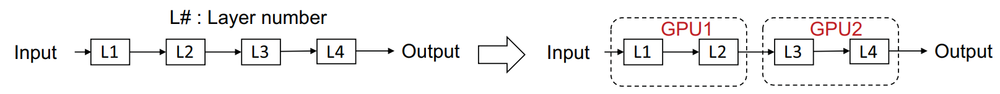
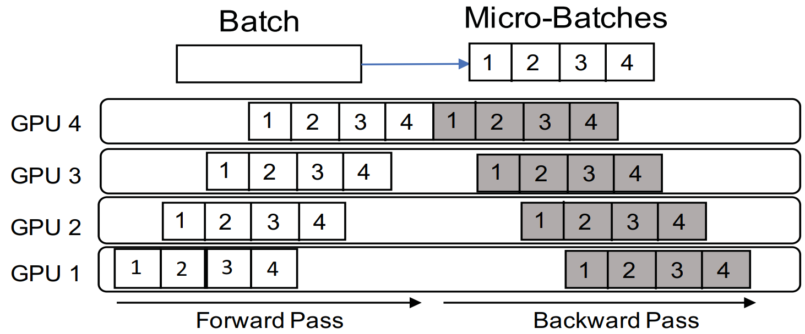
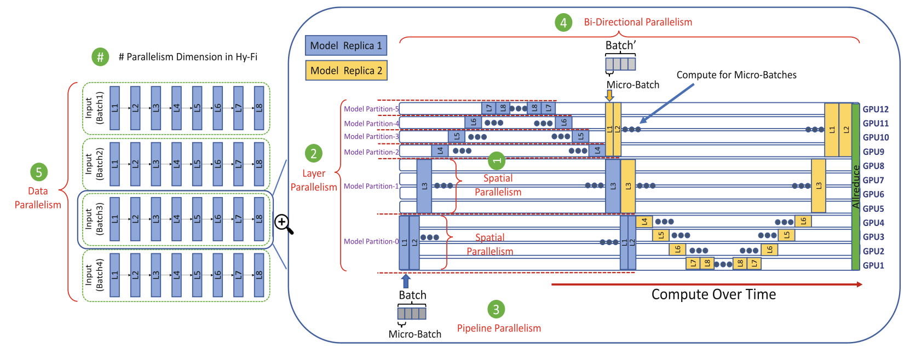

MPI4DL is a [HiDL](https://hidl.cse.ohio-state.edu/) project. We encourage you to visit the [HiDL website](https://hidl.cse.ohio-state.edu/) for additional information, the latest performance numbers, and similar projects on high-performance machine and deep learning. For the latest announcements on HiDL projects, [register for the HiDL mailing list](https://hidl.cse.ohio-state.edu/mailinglists/).


# News
**[11/9/2023]** We now support several new spatial parallelism combinations, such as SP+GEMS+LP and SP+GEMS+PP. For a full list of new and existing features, please see [the MPI4DL feature page](http://hidl.cse.ohio-state.edu/features/#MPI4DL)

# MPI4DL v0.6

The size of image-based DL models regularly grows beyond the memory available on a single processor (we call such models **out-of-core**), and require advanced parallelism schemes to fit within device memory. Further, the massive image sizes required in specialized applications such as medical and satellite imaging can themselves place significant device memory pressure, and require parallelism schemes to process efficiently during training. Finally, the simplest parallelism scheme, [layer parallelism](#layer-parallelism), is highly inefficient. While there are several approaches that have been proposed to address some of the limitations of layer parallelism. However, most studies are performed for low-resolution images that exhibit different characteristics. Compared to low-resolution images, high-resolution images (e.g. digital pathology, satellite imaging) result in higher activation memory and larger tensors, which in turn lead to a larger communication overhead.    

<div align="center">
 
 <br>
 <figcaption>Figure 1. Capabilities of each parallelism scheme for low-resolution, high-resolution and very high resolution images.
</figcaption>

<br>
</div>
<br>

([Figure Source](https://doi.org/10.1007/978-3-031-07312-0_6))

Figure 1 shows capabilities of each parallelism scheme with respect to diferent image sizes. Data parallelism has a memory limitation and cannot be performed for out-of-core models. [Layer parallelism](#layer-parallelism) overcomes the limitation of data parallelism by distributing the model across different GPUs. However, it causes GPU underutilization as only one GPU is utilized. Pipeline parallelism accelerates the performance of layer parallelism by training the model in a pipeline fashion. However, pipeline parallelism is only possible when the model is trainable with a batch size > 1, which is typically impossible with high-resolution images due to memory constraints. To train high-resolution images, spatial parallelism can be used, which distributes images across multiple GPUs. On the other hand, it has performance issues due to high communication overhead and the inability to accelerate low-resolution images that are common in the latter half of DNNs.


**Our objective is efficiently utilizing distributed training for dense convolutional neural networks and very high-resolution images that appear in real-world applications such as medical images. Integrating spatial and layer parallelism can solve the aforementioned limitations of spatial parallelism and layer parallelism. Spatial parallelism enables training high-resolution images efficiently even when the model size is large, and layer parallelism accelerates low-resolution images in the latter half of DNNs. This schema enables training high-resolution images efficiently. This project is a PyTorch implementation of mentioned approach and is based on [Hy-Fi: Hybrid Five-Dimensional Parallel DNN Training on High-Performance GPU Clusters](https://dl.acm.org/doi/abs/10.1007/978-3-031-07312-0_6).**

# Background

## Data Parallelism
Data parallelism instantiates a replica of the model weights on each set of GPUs, then sends distinct batches of data to each model replica at each training step. Each replica independently calculates the gradient updates using its data batch, then averages the gradient updates with all other replicas to update the global copy of weights.

<div align="center">
 
 </br>
 <figcaption>Figure 2. Data parallelism </figcaption>
    </br>
</div>

([Figure Source](https://xiandong79.github.io/Intro-Distributed-Deep-Learning))


## Layer Parallelism
Layer parallelism distributes the DNN model on separate GPUs before applying distributed forward and backward passes. These distributed forward and backward passes are implemented with simple Send and Recv operations. Thus, layer parallelism suffers from under-utilization of resources and scalability, as only a single GPU can operate at once.

<div align="center">
 
 </br>
 <figcaption>Figure 3. Layer parallelism </figcaption>
    </br>
</div>

([Figure Source](https://doi.org/10.1109/SC41405.2020.00049))

## Pipeline Parallelism
Pipelining divides the input batch into smaller batches called micro-batches, the number of which we call parts. The goal of pipeline parallelism is to reduce underutilization by overlapping micro-batches, which allows multiple GPUs to proceed with computation within the forward and backward passes.

<div align="center">
 
 </br>
 <figcaption>Figure 4. Pipeline parallelism (Courtesy: https://doi.org/10.1109/SC41405.2020.00049) </figcaption>
    </br>
</div>

([Figure Source](https://doi.org/10.1109/SC41405.2020.00049))

## Spatial Parallelism

In spatial parallelism, the convolution layer is replicated across multiple GPUs, and image parts are partitioned across replicas. Convolution and Pooling layers can be distributed across multiple GPUs to work on different regions of the image. Hence, unlike layer parallelism, this approach enables simultaneous computation on multiple GPUs while facilitating the training of the out-of-core convolution layer, but it requires extra communication to receive border pixels from neighboring partitions, also called halo-exchange. Refer [Halo exchange](benchmarks/communication/halo) for more information.

## Spatial Parallelism + Layer Parallelism

<div align="center">
 
 </br>
 <figcaption>Figure 6. Combination of spatial and layer parallelism. </figcaption>
    </br>
</div>

([Figure Source](https://doi.org/10.1007/978-3-031-07312-0_6))

Above figure shows combination of spatial and layer parallelism. In this approach, the model is divided into 4 partitions, and spatial parallelism is used for the first partition to perform convolution operations on the input image. The second layer aggregates the output from the first layer and then sends it, while lateral layers use layer parallelism.

Due to the increased communication overhead, spatial parallelism is more suitable for large images, which makes this approach inappropriate for the latter half of CNNs where the image input size usually consists of few pixels. Layer parallelism can be used to compute this latter half. Figure 2 shows a combination of spatial parallelism and layer parallelism for a CNN partitioned into four partitions at the layer granularity. Spatial parallelism is applied to the first model partition, and layer parallelism is applied to the other three model partitions.

Refer [Spatial Parallelism](benchmarks/spatial_parallelism) for more details.

## Combining Them into 5D Parallelism

Putting this all together, we can exploit each dimension of parallelism to achieve the best throughput on a given hardware and model architecture.

<div align="center">
 
 </br>
 <figcaption>Figure 7. Combination of spatial, bidirectional, data, pipeline, and layer parallelism. </figcaption>
    </br>
</div>

([Figure Source](https://doi.org/10.1007/978-3-031-07312-0_6))

## Installation

### Prerequisites
- Python 3.8 or later (for Linux, Python 3.8.1+ is needed).
- MVAPICH2-GDR </br>
Refer [MVAPICH2-GDR user guide](https://mvapich.cse.ohio-state.edu/userguide/gdr/) to install MVAPICH2-GDR.
- PyTorch :  1.12.1 or 1.13.1 </br>
Refer [PyTorch installation guide](/docs/installation/PYTORCH_INSTALLATION_GUIDE.md) to install PyTorch from source and configure MVAPICH2 support. 

*Note:
We used the following versions during implementation and testing.
Python=3.9.16, cuda=11.6, gcc=10.3.0, cmake=3.22.2, PyTorch=1.12.1, MVAPICH2-GDR=2.3.7*

### Install MPI4DL
```bash
cd mpi4dl
python setup.py install
```
### Run model benchmarks
Example to run AmoebaNet model with partition size for model as two, spatial partition as four and spatial size (i.e. number of model partition which will use spatial partition) as 1
```bash
$MV2_HOME/bin/mpirun_rsh --export-all -np 5 --hostfile {$HOSTFILE} MV2_USE_CUDA=1 MV2_HYBRID_BINDING_POLICY=spread MV2_CPU_BINDING_POLICY=hybrid MV2_USE_GDRCOPY=0 PYTHONNOUSERSITE=true LD_PRELOAD=$MV2_HOME/lib/libmpi.so python benchmarks/spatial_parallelism/benchmark_amoebanet_sp.py --image-size 512 --num-spatial-parts 4 --slice-method "vertical" --split-size 2 --spatial-size 1
```

Refer [Spatial Parallelism](benchmarks/spatial_parallelism) and [Halo Exchange](benchmarks/communication/halo) for more spatial benchmarks.

## References
1. Arpan Jain, Ammar Ahmad Awan, Asmaa M. Aljuhani, Jahanzeb Maqbool Hashmi, Quentin G. Anthony, Hari Subramoni, Dhableswar K. Panda, Raghu Machiraju, and Anil Parwani. 2020. GEMS: <u>G</u>PU-<u>e</u>nabled <u>m</u>emory-aware model-parallelism <u>s</u>ystem for distributed DNN training. In Proceedings of the International Conference for High Performance Computing, Networking, Storage and Analysis (SC '20). IEEE Press, Article 45, 1–15. https://doi.org/10.1109/SC41405.2020.00049
2. Arpan Jain, Aamir Shafi, Quentin Anthony, Pouya Kousha, Hari Subramoni, and Dhableswar K. Panda. 2022. Hy-Fi: Hybrid Five-Dimensional Parallel DNN Training on High-Performance GPU Clusters. In High Performance Computing: 37th International Conference, ISC High Performance 2022, Hamburg, Germany, May 29 – June 2, 2022, Proceedings. Springer-Verlag, Berlin, Heidelberg, 109–130. https://doi.org/10.1007/978-3-031-07312-0_6

