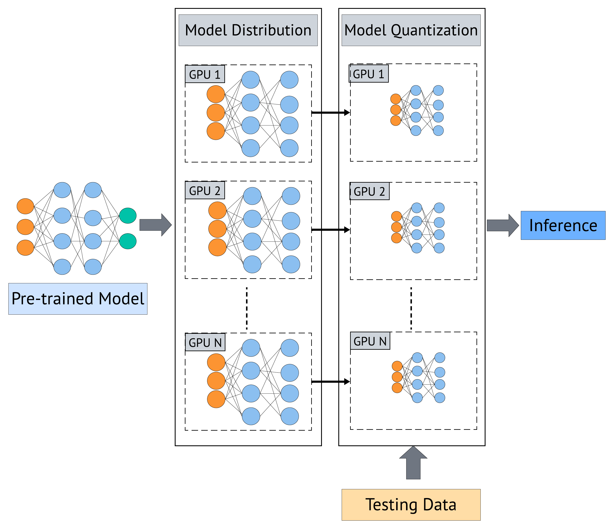
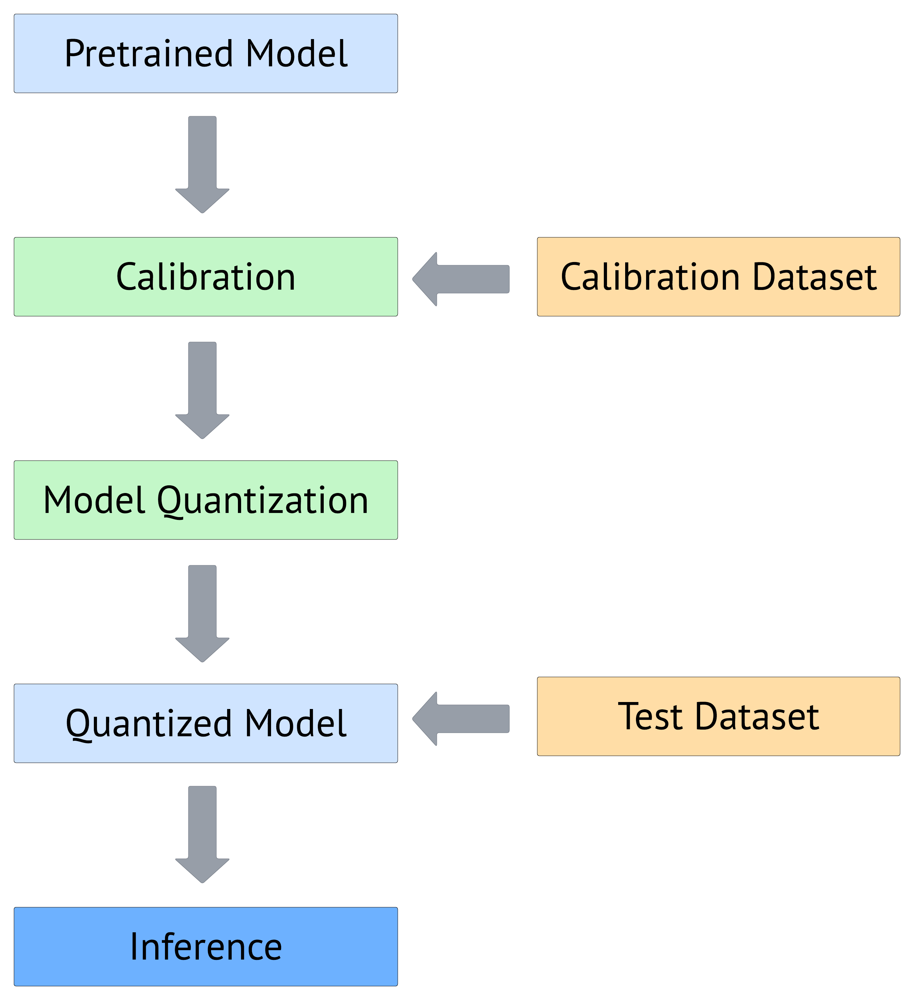
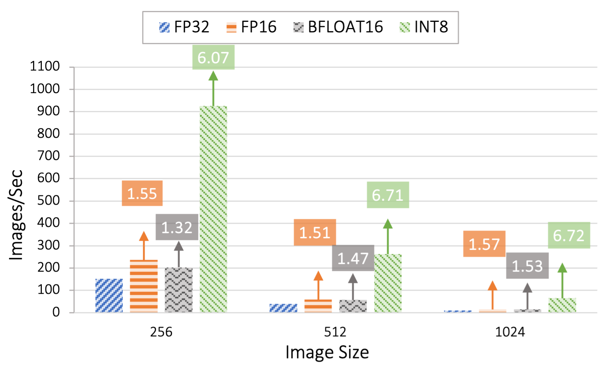
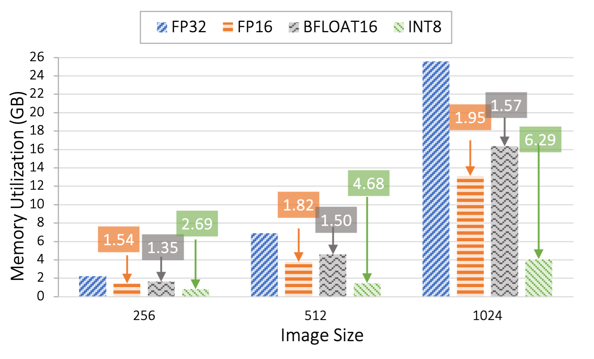
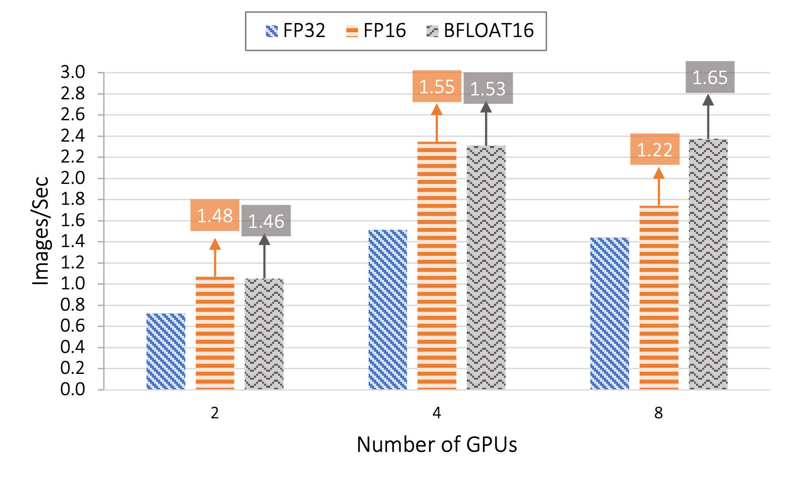
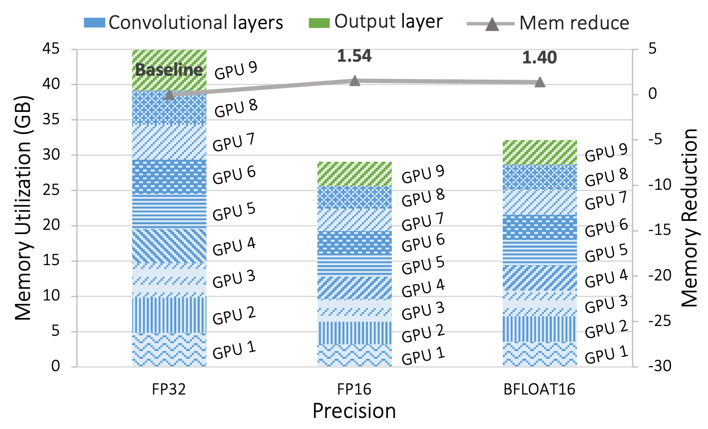
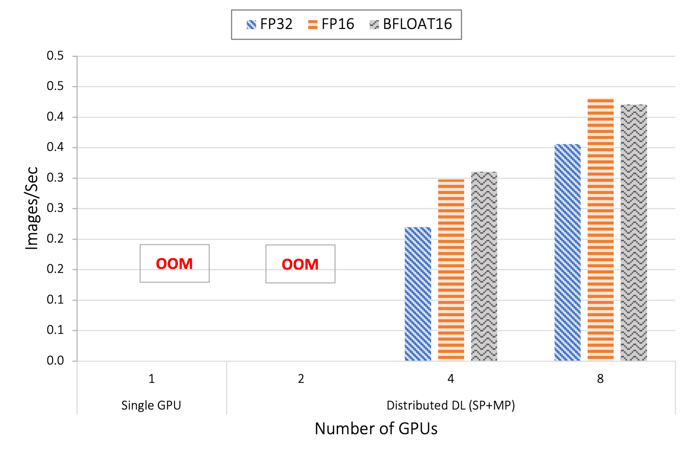
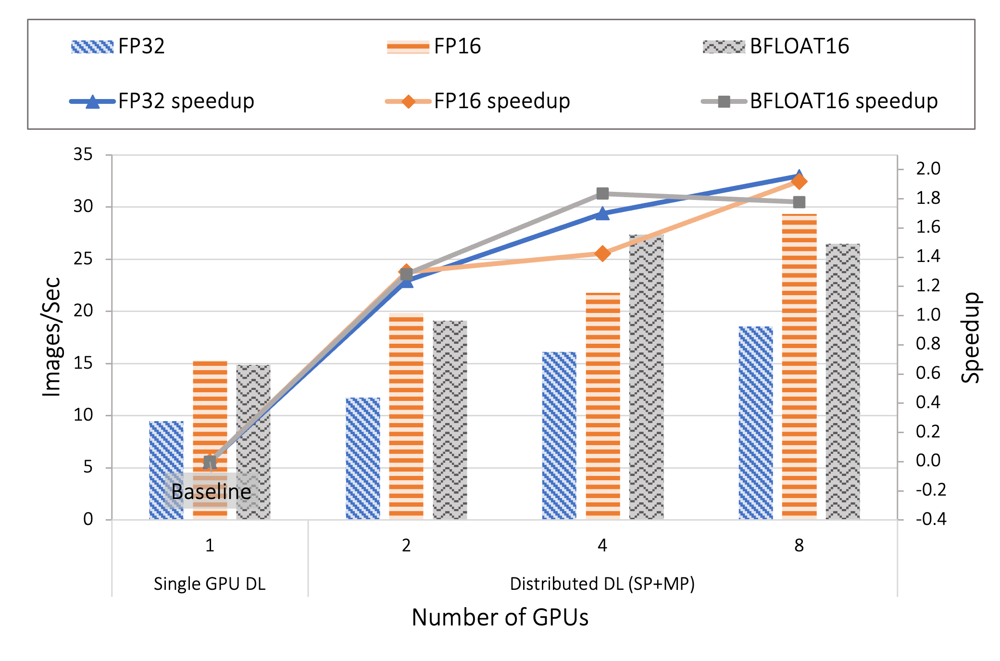

## Inference with quantization for High-Resolution Images

This project facilitates inference with quantization for high-resolution images, offering support for integer-only (INT8) and half-precision (FLOAT16/BFLOAT16) for single-GPU inference. Furthermore, for scaled images (e.g., beyond 2048×2048 or 4096×4096), we leverage Spatial Parallelism (referenced as a parallelism technique for Distributed Deep Learning) with support for half-precision quantization. We evaluate inference with quantization on different datasets, including real-world pathology dataset: [CAMELYON16](https://camelyon16.grand-challenge.org/), and object detection datasets:[ImageNet](https://www.image-net.org/),[Cifar10](https://www.cs.toronto.edu/~kriz/cifar.html), achieving accuracy degradation of less than 1%.

<div style="text-align:center;">
  <div style="display:inline-block; margin:10px;">
    
    <p> (a)Overview of Post Training Quantization Pipeline</p>
  </div>
  <div style="display:inline-block; margin:10px;">
    
    <p stype> (b) Inference pipeline for quantization in Distributed DL</p>
  </div>
  <p style="width:100%; text-align:center; font-weight:bold;">Quantization in Deep Learning</p>
</div>

## Installation

### Prerequisites
- Python 3.8 or later (for Linux, Python 3.8.1+ is needed).
- [NCCL](https://developer.nvidia.com/nccl)
- [PyTorch](https://pytorch.org/) >=  1.13.1 </br>
- [Tensor-Rt](https://docs.nvidia.com/deeplearning/tensorrt/install-guide/index.html) (if you are using INT8 quntization) Installation instructions : https://pytorch.org/TensorRT/getting_started/installation.html

*Note:
We used the following versions during implementation and testing.
Python=3.9.16, cuda=11.6, gcc=10.3.0, cmake=3.22.2, PyTorch=1.13.1*

### Install Infer-HiRes
```bash
cd quant-infer
python setup.py install
```

# Results

## Single-GPU Evaluation
<div style="text-align:center;">
  <div style="display:inline-block; margin:10px;">
    
    <p> (a)Throughput Evaluation on Single GPU</p>
  </div>
  <div style="display:inline-block; margin:10px;">
    
    <p> (b)Memory Utilization Evaluation on Single GPU</p>
  </div>
  <p style="width:100%; text-align:center; font-weight:bold;">Figure 1. Throughput and Memory Evaluation on a single GPU for the ResNet101 model with different image sizes and batch
size 32. The speedup and memory reduction is shown in respective colored boxes for FP16, BFLOAT16, and INT8 when compared
to baseline FP3</p>
</div>

## Spatial Paralleism Evaluation
<div style="text-align:center;">
  <div style="display:inline-block; margin:10px;">
    
    <p> (a)Throughput Evaluation for 4096x4096 Image Size on 2, 4, and 8 GPUs </p>
  </div>
  <div style="display:inline-block; margin:10px;">
    
    <p> (b) Memory footprints on 9 GPUs for SP+LP with image size 4096×4096 </p>
  </div>
  <p style="width:100%; text-align:center; font-weight:bold;">Figure 2. Throughput and Memory Evaluation using SP+LP for ResNet101 model with image sizes of 4096x4096. The evaluation is done by comparing quantized model of FP16, BFLOAT16 quantization with FP32 as the baseline</p>
</div>
<br>
<br>

<div style="text-align:center;">
  <div style="display:inline-block; margin:10px;">
    
    <p> (a) Enabling inference for 8192×8192 with FP16 </p>
  </div>
  <div style="display:inline-block; margin:10px;">
    
    <p> (b) Accelerating performance with SP </p>
  </div>
  <p style="width:100%; text-align:center; font-weight:bold;">Figure 3. Enabling scaled images and accelerating performance using SP</p>
</div>


### Run Inference

# Using Single-GPU
Example to run ResNet model with model partition set to two, spatial partition set to four, with half-precision quantization.
```bash
        python benchmarks/spatial_parallelism/benchmark_resnet_inference.py \
        --batch-size ${batch_size} \
        --image-size ${image_size} \
        --precision int_8 \
        --datapath ${datapath} \
        --checkpoint ${checkpoint} \
        --enable-evaluation &>> $OUTFILE 2>&1
```

*Note : supported quntization(precision) options includes 'int8'(INT8), 'fp_16'(FLOAT16), and 'bp_16'(BFLOAT16). For training your model remove '--enable-evaluation' flag.*

# Using Spatial Paralleism
Example to run ResNet model with model partition set to two, spatial partition set to four, with half-precision quantization.

```bash
$MV2_HOME/bin/mpirun_rsh --export-all -np $total_np\
        --hostfile ${hostfile}  \
        MV2_USE_CUDA=1 \
        MV2_HYBRID_BINDING_POLICY=spread \
        MV2_CPU_BINDING_POLICY=hybrid \
        MV2_USE_GDRCOPY=0 \
        PYTHONNOUSERSITE=true \
        LD_PRELOAD=$MV2_HOME/lib/libmpi.so \
        python benchmarks/spatial_parallelism/benchmark_resnet_sp.py \
        --batch-size ${batch_size} \
        --split-size 2 \
        --slice-method square \
        --num-spatial-parts 4 \
        --image-size ${image_size} \
        --backend nccl \
        --precision fp_16 \
         --datapath ${datapath} \
        --checkpoint ${checkpoint} \
        --enable-evaluation &>> $OUTFILE 2>&1
```

Refer [Spatial Parallelism](benchmarks/spatial_parallelism), [Layer Parallelism](benchmarks/layer_parallelism) and [with Single GPU]() for more benchmarks.

## References
1. Arpan Jain, Ammar Ahmad Awan, Asmaa M. Aljuhani, Jahanzeb Maqbool Hashmi, Quentin G. Anthony, Hari Subramoni, Dhableswar K. Panda, Raghu Machiraju, and Anil Parwani. 2020. GEMS: <u>G</u>PU-<u>e</u>nabled <u>m</u>emory-aware model-parallelism <u>s</u>ystem for distributed DNN training. In Proceedings of the International Conference for High Performance Computing, Networking, Storage and Analysis (SC '20). IEEE Press, Article 45, 1–15. https://doi.org/10.1109/SC41405.2020.00049
2. Arpan Jain, Aamir Shafi, Quentin Anthony, Pouya Kousha, Hari Subramoni, and Dhableswar K. Panda. 2022. Hy-Fi: Hybrid Five-Dimensional Parallel DNN Training on High-Performance GPU Clusters. In High Performance Computing: 37th International Conference, ISC High Performance 2022, Hamburg, Germany, May 29 – June 2, 2022, Proceedings. Springer-Verlag, Berlin, Heidelberg, 109–130. https://doi.org/10.1007/978-3-031-07312-0_6

