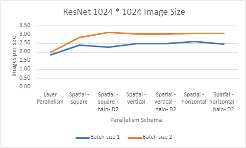

# now-dl

This is a Deep Learning Parallelism framework written in PyTorch that provides distributed implementations for spatial parallelism [1] and GEMS (GPU-Enabled Memory-Aware Model-Parallelism System) [2]. Furthermore, the framework provide support for training of DNN models using hybrid parallelism, which includes data, model, spatial, pipeline, and bi-directional parallelism.

The objective is to facilitate the training of out-of-core or large-scale Deep Neural Networks for high-resolution images. Additionally, it utilizes various parallelism techniques to further reduce the training time, making it faster and more efficient.

## Spatial Parallelism:

Spatial parallelism involves dividing the input image spatially into partitions based on spatial types such as "vertical," "horizontal," or "square." These partitions are then distributed among different GPUs to perform computations, enabling deep learning training on high-resolution images. Furthermore, spatial parallelism can be combined with other parallelism techniques, such as model, pipeline, and bi-directional parallelism, to further optimize the training process.

<div align="center">
 
</div>

*Figure 1 illustrates the combination of spatial and model parallelism. In this approach, the CNN is divided into four partitions. Spatial parallelism is applied to the first partition, while the rest of the partitions use model parallelism. Configurations used num_spatial_parts = 4, split_size = 4, spatial_size = 1.*

You could refer to [Spatial Parallelism implementation](https://github.com/OSU-Nowlab/now-dl/tree/main/benchmarks/spatial) for more details.

## GEMS(GPU-Enabled Memory-Aware Model-Parallelism System):
GEMS aims to train very large DNNs for high-resolution images, commonly used in digital pathology. It achieves significant speed-up over state-of-the-art systems by utilizing memory-aware designs, overlapping computation, and data parallelism. This includes different design schemes, such as GEMS-MAST, GEMS-MASTER, and GEMS-Hybrid.

<div align="center">
 
</div>

*Figure 2 shows a memory view of the GEMS MAST design for forward and backward passes of two model replicas and the improvement made possible by it.*

The implementation will soon be made available as an open-source project.

## Installation:

### Prerequisite:
- Python 3.8 or later (for Linux, Python 3.8.1+ is needed)
- PyTorch :
To enable MPI support, it is required to install PyTorch from source. 

```bash
git clone https://github.com/pytorch/pytorch
git checkout v1.12.1
```

Add cuda-aware MPI support
Modify pytorch/caffe2/mpi/mpi_ops_gpu.cc:
```bash
#define CAFFE2_HAS_CUDA_MPI_BASICS 1
#define CAFFE2_HAS_CUDA_MPI_ALLREDUCE 1
```

Modify torch/csrc/distributed/c10d/ProcessGroupMPI.cpp
```bash
#if defined(MPIX_CUDA_AWARE_SUPPORT)
  if (MPIX_Query_cuda_support() == 1) {
    return true;
  } else {
    return true;
  }
#else // !defined(MPIX_CUDA_AWARE_SUPPORT)
  return true;
#endif // MPIX_CUDA_AWARE_SUPPORT
}
```

Refer following page to install PyTorch https://github.com/pytorch/pytorch

- MVAPICH2
To install MVAPICH2, follow instructions mentioned on MVAPICH download http://mvapich.cse.ohio-state.edu/downloads/#mv2.3.7

- NVIDIA CUDA 11.0 or above
- NVIDIA GPU Compute Capability >= 7.0 (V100/RTX20 and higher)
- Linux OS

[Note:
We used the following versions during implementation and testing.
Python=3.9.16, cuda=11.6, gcc=10.3.0, cmake=3.22.2, PyTorch=1.12.0a0+git35202d2, MVAPICH2-GDR=2.3.7]

### Install now-dl:
- Load Required model:
```bash
cd torch-gems
python setup.py install
```
Example to run Amoebanet model with partition size for model as two, spatial partition as four and spatial size (i.e. number of model partition which will use spatial partition) as 1
```bash
$MV2_HOME/bin/mpirun_rsh --export-all -np 5 --hostfile {$HOSTFILE} MV2_USE_GDRCOPY=0 MV2_ENABLE_AFFINITY=0 MV2_USE_CUDA=1 LD_PRELOAD=$MV2_HOME/lib/libmpi.so python benchmarks/spatial/model/amoebanet_run.py --image-size 512 --num-spatial-parts 4 --slice-method "vertical" --split-size 2 --spatial-size 1
```

## Experimental Results:

#### Using Spatial, Model and Pipeline Parallelism, where the model is split into two parts and utilizes spatial parallelism by dividing the image into four parts

- AmeobaNet Model 

<div align="center">
 
 
</div>

- ResNet Model 

<div align="center">
 
 
</div>


## References:
1. Arpan Jain, Ammar Ahmad Awan, Asmaa M. Aljuhani, Jahanzeb Maqbool Hashmi, Quentin G. Anthony, Hari Subramoni, Dhableswar K. Panda, Raghu Machiraju, and Anil Parwani. 2020. GEMS: <u>G</u>PU-<u>e</u>nabled <u>m</u>emory-aware model-parallelism <u>s</u>ystem for distributed DNN training. In Proceedings of the International Conference for High Performance Computing, Networking, Storage and Analysis (SC '20). IEEE Press, Article 45, 1–15.
2. Arpan Jain, Aamir Shafi, Quentin Anthony, Pouya Kousha, Hari Subramoni, and Dhableswar K. Panda. 2022. Hy-Fi: Hybrid Five-Dimensional Parallel DNN Training on High-Performance GPU Clusters. In High Performance Computing: 37th International Conference, ISC High Performance 2022, Hamburg, Germany, May 29 – June 2, 2022, Proceedings. Springer-Verlag, Berlin, Heidelberg, 109–130. https://doi.org/10.1007/978-3-031-07312-0_6

