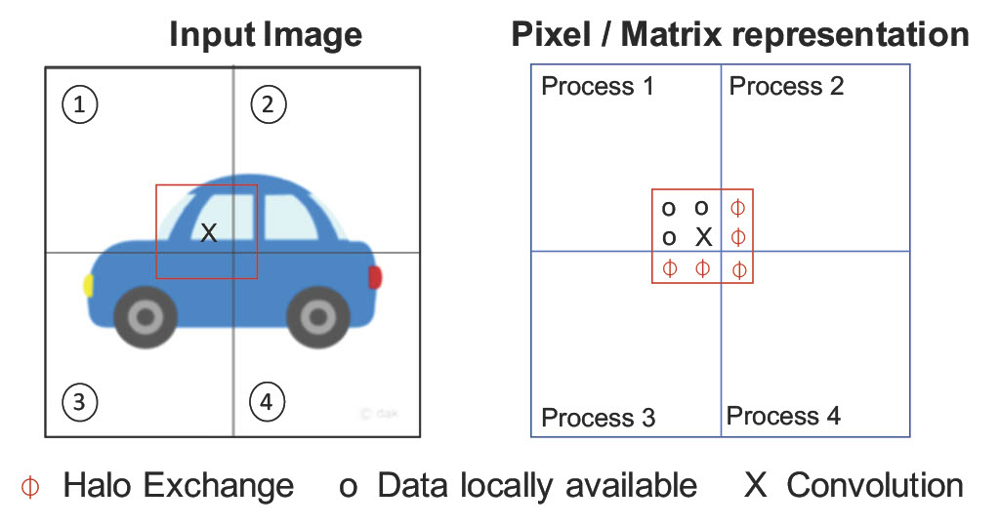

#  Halo exchnage:
In spatial parallelism, Convolution and Pooling layers can be distributed across multiple GPUs to work on the different regions of the image. Thus, spatial parallelism requires a halo exchange (shown in Figure. 1.) at every convolution and pooling layer to compute the result for the pixels present on the boundary of image parts. Halo exchange can also be performed in parallel with convolution operations on available input pixels.
<div align="center">
 
 </br>
  <figcaption>Figure 1. Halo exchange in spatial parallelism. The input image is partitioned into four regions, and each region is given to the different processes. To calculate the convolution operation at X location, the value of nearby pixels is required. 
  </figcaption>
    </br>
</div>


## halo-exchange benchmarks:
- *benchmark_sp_halo_exchange.py* and *benchmark_sp_halo_exchange_with_compute.py* are used to test the proper functioning of send and receive operations for halo regions.
- *benchmark_sp_halo_exchange_with_compute_val.py* is utilized to validate the received inputs, in addition to testing the halo region send and receive operations.

### Install now-dl:
```bash
cd now-dl
python setup.py install
```

### Run halo-exchange benchmark

#### Generic command:
```bash

$MV2_HOME/bin/mpirun_rsh --export-all -np $np --hostfile  {$HOSTFILE} MV2_USE_GDRCOPY=0 MV2_ENABLE_AFFINITY=0 MV2_USE_CUDA=1 LD_PRELOAD=$MV2_HOME/lib/libmpi.so python ${halo_benchmark} --image-size ${image_size} --batch-size ${batch_size} --num-spatial-parts ${num_spatial_parts} --slice-method ${partition}

```
#### Example:
Example to run halo exchange benchmark for four vertical partition : 
```bash
cd benchmarks/spatial/model/
$MV2_HOME/bin/mpirun_rsh --export-all -np 4 --hostfile {$HOSTFILE} MV2_USE_GDRCOPY=0 MV2_ENABLE_AFFINITY=0 MV2_USE_CUDA=1 LD_PRELOAD=$MV2_HOME/lib/libmpi.so python now-dl/benchmarks/communication/halo/benchmark_sp_halo_exchange.py --image-size 32 --batch-size 32 --num-spatial-parts 4 --slice-method "vertical"
```

Halo exchange benchmarks can also be configured for different num-spatial-parts, slice-method, etc. Find all available options below:
<pre>
usage: spatial_halo_exchange_bench.py [-h] [--fp16-allreduce] [--image-size IMAGE_SIZE] [--batch-size BATCH_SIZE] [--halo-len HALO_LEN] [--in-channels IN_CHANNELS]
                                      [--warmup WARMUP] [--iterations ITERATIONS] [--out-channels OUT_CHANNELS]

Halo exchange benchmark

optional arguments:
  -h, --help            show this help message and exit
  --fp16-allreduce      use fp16 compression during allreduce (default: False)
  --image-size IMAGE_SIZE
                        Full image size (default: 8)
  --batch-size BATCH_SIZE
                        input batch size (default: 1)
  --halo-len HALO_LEN   halo length (default: 1)
  --in-channels IN_CHANNELS
                        Number of channels in the input (default: 1)
  --warmup WARMUP       warmups (default: 10)
  --iterations ITERATIONS
                        Iterations (default: 100)
  --out-channels OUT_CHANNELS
                        number of output channels (default: 256)
</pre>